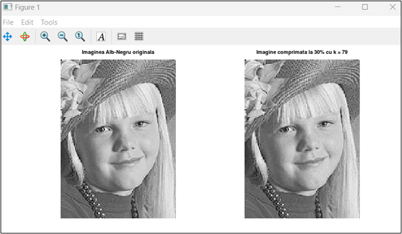
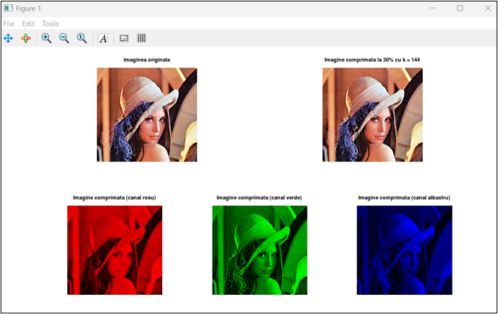
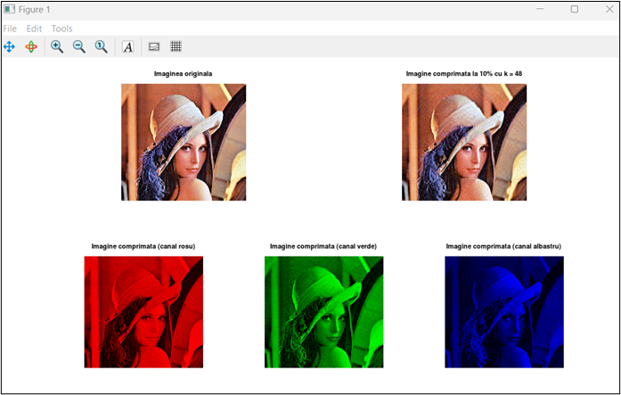

# ImageCompressionSVD

A project focused on image compression using Singular Value Decomposition (SVD). It includes implementations for both grayscale and color image compression.

## Features

- **Compression of grayscale and color images** using SVD.
- **Adjustable compression ratio** based on the number of singular values retained.
- **Efficient reconstruction** with minimal quality loss.
- **MATLAB/Octave implementation** for easy experimentation and extension.

## Getting Started

Follow these steps to set up and run the project on your local machine.

### Prerequisites

- MATLAB or GNU Octave (recommended for compatibility).

### Installation

Clone the repository using:

```bash
git clone https://github.com/galbinasuana/Image-Compression-SVD.git
```

## Usage

### Compressing a Grayscale Image

1. Open `svd_imagine_monocrom.m` in MATLAB/Octave.
2. Run the script and specify the desired compression percentage.
3. The script will display the original and compressed grayscale images for comparison.
4. The compressed image will be saved automatically.

### Compressing a Color Image

1. Open `svd_imagine_color.m` in MATLAB/Octave.
2. Run the script and input the compression percentage.
3. The script applies SVD to each color channel separately and reconstructs the compressed image.
4. The original and compressed color images will be displayed, along with separate views of compressed color channels.
5. The compressed image will be saved automatically.

## Understanding the Code

### Grayscale Image Compression

- The script reads a grayscale image and represents it as a matrix.
- It performs **SVD decomposition** on the image matrix.
- The singular values are truncated based on the compression percentage.
- The image is reconstructed using the reduced matrices.

### Color Image Compression

- The script reads an RGB image and separates it into Red, Green, and Blue channels.
- It applies **SVD compression** to each color channel separately.
- The compressed channels are combined to form the final compressed image.

## Example Results

### Grayscale Image Compression

**Compression with 30% singular values**  


**Compression with 10% singular values**  


### Color Image Compression

**Compression with 30% singular values**  


**Compression with 10% singular values**  
